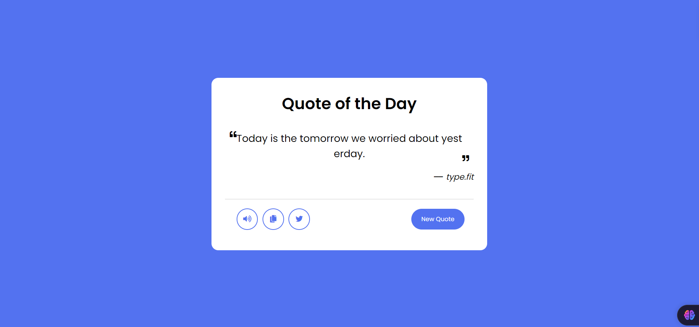

# Quote Generator

This project is a simple web application that generates random quotes along with their authors. Users can generate a new quote, listen to the quote via text-to-speech, copy the quote to the clipboard, and share the quote on Twitter.

  

## Features

- **Random Quote Generation**: Displays a random quote from an extensive list of quotes fetched from the Type.fit API.
- **Text-to-Speech**: Allows users to hear the quote read aloud.
- **Copy to Clipboard**: Provides functionality to copy the current quote to your clipboard.
- **Twitter Integration**: Enables sharing of the quote directly on Twitter.

## Technologies Used

- **HTML5**: Structure of the web page.
- **CSS3**: Styling of the web page.
- **JavaScript (ES6)**: Logic for fetching quotes, text-to-speech, copying to clipboard, and sharing on Twitter.
- **[Type.fit API](https://type.fit/api/quotes)**: Source of the random quotes and authors.

## How to Use

1. **Generate a New Quote**: Click the "New Quote" button to fetch and display a random quote.
2. **Listen to the Quote**: Click the speaker icon to hear the quote read aloud using the browser's text-to-speech functionality.
3. **Copy the Quote**: Click the copy icon to copy the quote to your clipboard.
4. **Share on Twitter**: Click the Twitter icon to share the quote directly on Twitter.

## Installation and Setup

To run this project locally:

1. **Clone the repository**:
   ```bash
   git clone https://github.com/Prashanth0718/quote-generator.git
   ```
2. **Navigate to the project directory**:
   ```bash
   cd quote-generator
   ```
3. **Open the `index.html` file** in your web browser:
   - Double-click on the `index.html` file or open it with a browser of your choice.

## Project Structure

- **index.html**: The main HTML file that structures the web page.
- **style.css**: The CSS file responsible for styling the web page.
- **script.js**: The JavaScript file that handles fetching quotes, updating the DOM, and enabling interactivity.

## Future Enhancements

- **Quote Categorization**: Add the ability to filter quotes by category (e.g., motivation, love, wisdom).
- **Favorite Quotes**: Allow users to save and view their favorite quotes.
- **Enhanced API Integration**: Explore additional APIs to provide a more diverse range of quotes.

## Contributing

Contributions are welcome! If you have suggestions or improvements, feel free to open an issue or submit a pull request. Please follow the coding standards and guidelines provided in the [CONTRIBUTING.md](CONTRIBUTING.md) file.

## Demo

Check out the live demo of the project at [https://prashanth0718.github.io/Quote-Generator/](https://prashanth0718.github.io/Quote-Generator/).

## Additional Resources

- [Type.fit API Documentation](https://type.fit/api/quotes)
- [JavaScript Fetch API Documentation](https://developer.mozilla.org/en-US/docs/Web/API/Fetch_API)
- [Speech Synthesis API Documentation](https://developer.mozilla.org/en-US/docs/Web/API/SpeechSynthesis)

## Contact

For any questions or feedback, please contact me at [prashanthsn2003@gmail.com](mailto:prashanthsn2003@gmail.com) or through my [GitHub profile](https://github.com/Prashanth0718).

