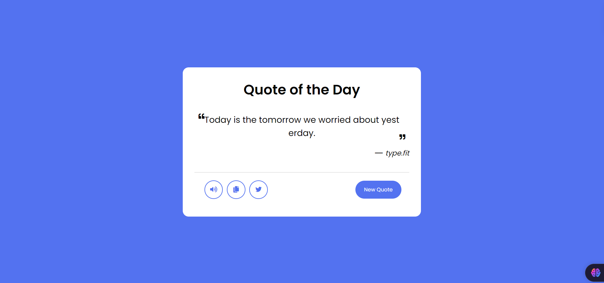

# Quote Generator

A simple and stylish web application that generates random quotes. Users can get a new quote, listen to it using speech synthesis, copy it to the clipboard, or share it on Twitter. Built with HTML, CSS, and JavaScript.

## Features

- **Random Quote Generation**: Fetches random quotes from an external API.
- **Speech Synthesis**: Reads the quote aloud using the browser's speech synthesis feature.
- **Copy to Clipboard**: Allows users to copy the quote to their clipboard.
- **Twitter Sharing**: Users can easily share quotes on Twitter.

## Live Demo

Check out the live demo of the application [here](https://prashanth-s-n-quote-generator.netlify.app/).

## Screenshot

## How to Use

1. **Generate a Quote**: Click on the "New Quote" button to fetch a new quote.
2. **Listen to the Quote**: Click the speaker icon to hear the quote.
3. **Copy the Quote**: Click the copy icon to copy the quote to your clipboard.
4. **Share on Twitter**: Click the Twitter icon to share the quote on Twitter.

## Contributing

Contributions are welcome! If you have suggestions or improvements, feel free to open an issue or submit a pull request. Please follow the coding standards and guidelines provided in the `CONTRIBUTING.md` file.

## Contact

If you have any questions or feedback, feel free to contact me at [prashanthsn2003@gmail.com](mailto:prashanthsn2003@gmail.com).
